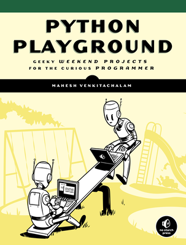

# Python Playground Plus

My book *Python Playground* (No Starch Press, USA) came out in 2015. It's a fun book of Python projects, which explores various ideas in mathematics, physics, computer graphics, and even delves into a bit of electronics hardware hacking. The book has been well-received, with over 10,000 copies sold as of 2017, and translated into 
three languages. 

This project is the continuation of my journey I started with *Python Playground*. Here I hope to explore interesting ideas in the same spirit, with the Python language as my vehicle. Enjoy!
