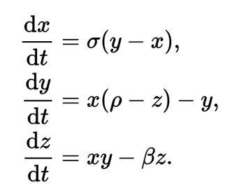
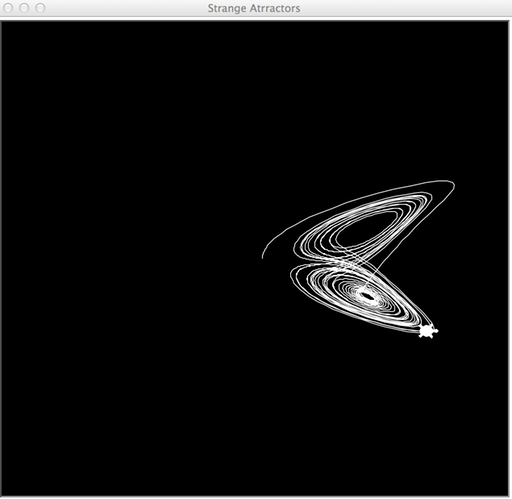

This article is part of my [Python Playground Plus](https://github.com/electronut/ppp) project. 

<hr/>

## Strange Attractors and Turtle Graphics

An [attractor][1] is a set of numerical values to which a mathematical system converges, and 
a *strange attractor* is one which in these values have a fractal structure. Though the mathematics 
of these constructs are quite scary, you don't need to be a genius to appreciate their beauty, or 
to write some Python code to plot them.

In this project, we're looking at two attactors - *Lorenz* and *Thomas*.

## The Lorenz Attractor

The [Lorenz equations][3] are given as:



In the code, the equations are solves using a simple time discretisation as follows:


<script src="https://gist.github.com/electronut/ee46d455233f167ad4c7fdde8e2504ae.js"></script>


The above code creates a closure 

To see it in action, run the code as follows:

```
python chaotic.py --axes zx --attr lorenz
```

Here's the output:



python chaotic.py --axes zx --attr thomas

## The 

[1]: https://en.wikipedia.org/wiki/Attractor
[2]: https://en.wikipedia.org/wiki/Fractal
[3]: https://en.wikipedia.org/wiki/Lorenz_system
